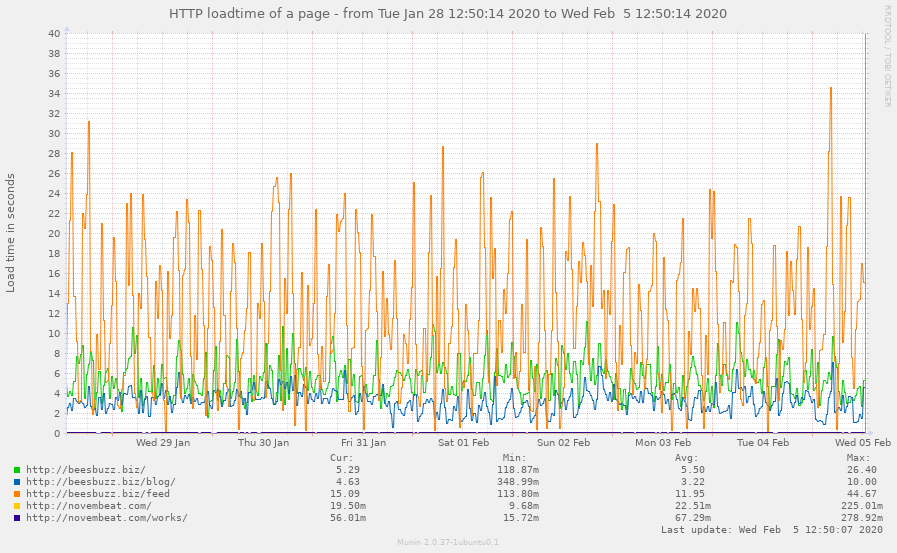
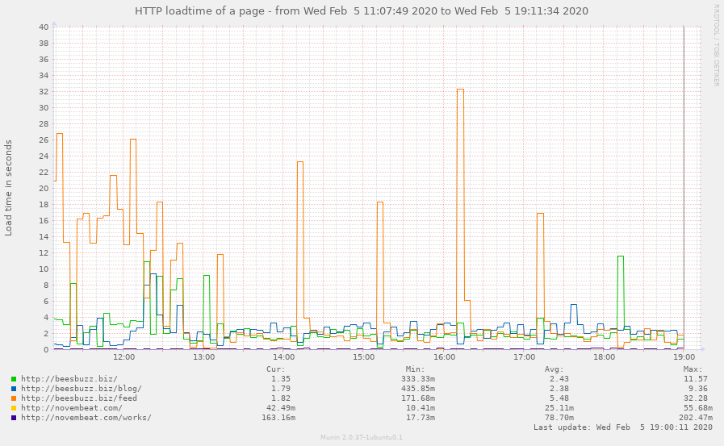

Title: Caching stats update
Tag: performance
Tag: caching
Entry-ID: 287
UUID: 39ff7921-798e-5013-a96e-7bfdb8ccf119
Date: 2020-02-05 13:23:28-08:00

A few weeks ago I had discovered that [caching wasn't actually being used most of the time](304), and took some stats snapshots for future comparison.

Now that Publ has been running with correct caching for a while, let's see how things have changed!

.....

## Caveats

These stats are based on overall site usage, so it includes both manual browsing and also search crawlers and feed readers and the like. Simply looking at the cache statistics doesn't paint a very clear picture of the actual performance improvements; in the stats, 10 users being able to quickly load a fresh blog entry quickly will be far overshadowed by a single search engine spidering the entire website and thrashing the cache, but those 10 users are, to me, far more important.

## Measurements

### Throughput

Here's a measurement of how much traffic the cache actually sees:

The first graph shows that before I fixed the caching, very little was being written to the cache, but the amount being read from it was pretty steady. As soon as the fix was made and the cache was being written to, amazingly enough it started actually receiving traffic. In the initial spike of activity, the read and write rate were about the same, which seems plausible for a cache that's being filled in with a relatively low hit rate. There's a steady read rate of around 40K/second and a steady write rate of around 8K/sec -- most of that being internal routines that were being written to the cache, uselessly.

The second graph (post-fix) shows a cache that's actually being actively used. There's an average write rate of 12K/sec, and a read rate of 17K/sec. There are also several write spikes at around 25K/sec, which I am suspecting are due to search crawler traffic.

### Allocation

This is where things get a bit more useful to look at -- how much stuff is actively being held in the cache?

Before the cache fix, the answer to that was, "Not much." The cache was averaging a size of a mere 868KB, and after I flipped the caching fix over, it jumped up considerably. During my testing of the fix, the size would spike up substantially and then drop down as cache items got evicted.

After the cache fix, the allocation went way up. It never went below 2MB, and during the write spikes it would jump up to 7MB or so. This is still far short of the 64MB I have allocated for the cache process.

### Commands/results

Here's what is actually happening in terms of the cache hits and misses:

Before, the graph shows an average of 44 hits per second, and .63 misses per second. The GET and SET rates are (unsurprisingly) more or less the same.

After, we see much more interesting patterns -- and not in a good way. It's averaging only 13 hits per second, and .8 misses per second, but that's an average. Eyeballing the graph it looks like the miss rate spikes at about the same time as the incoming traffic spikes, and outside of those spikes the hit rate is around 13 and the miss rate is... too small to reasonably estimate.

### Page load time

Also when I made the change I also started monitoring the load time of a handful of URLs, which is *interesting*:

What's interesting about these graphs is that Munin loads those URLs once every 5 minutes -- which happens to be the cache timeout, and so that does a lot to explain the rather chaotic nature of the load time graph, especially on the Atom feed (minimum of 113ms, maximum of 45 seconds, average of 12 seconds). The Atom feed is probably the most loadtime-intense page on my entire website, and would most strongly benefit from caching. This graph tells me that based on the average vs. max times, the Atom feed is getting a hit rate of around 25%. That isn't great.

## Conclusions

Aggregate memcached stats aren't really that useful for determining cache performance at this scale.

More to the point, the cache *as currently configured* probably isn't really making much of a difference. Items are falling out of the cache before they're really being reused.

## Next steps

It's worth noting that the default memcached expiry time is 5 minutes (which also happens to be how I had my sites configured), which feels like a good tradeoff between content staleness and performance optimization. However, Publ [soft-expires all cached items](https://github.com/PlaidWeb/Publ/commit/6ae4ae5731da46027ced9f0ea381dad66e3584a4#diff-650397549bec3d65892e233d5bd328f6R113) when there's a content change, so the only things that should linger with a longer expiry time are things like the "5 minutes ago" human-readable times on entries, which really don't matter if they're outdated.

As an experiment I will try increasing the cache timeout to an hour on all of my sites and see what effect that has. My hypothesis is that the allocation size and hit rate will both go up substantially, and the average page load time will go *way* down, with (much smaller) hourly spikes and otherwise a very fast page load (except for when I'm making content changes, of course).

I'm also tempted to try setting the default expiry to 0 -- as in, never expire, only evict -- and see what effect that has on performance. I probably won't, though -- it would have an odd effect on the display of humanized time intervals and make that way too nondeterministic for my taste.

## ==Update:== Initial results

Even after just a few hours it becomes *pretty obvious* what effect this change had:

The actual effect is a bit surprising, though; I would have expected the quiescent RAM allocation to be closer to the peak, and for the incoming (`SET`) traffic to be spikier after that as well. I wonder if improved site performance caused a malfunctioning spider to stop hammering my site quite so much, or something. I do know there are a bunch of spiders that have historically been pretty aggressive.

Of course the most important metric -- page load time -- has ended up *exactly* as I expected, with it dropping to an average of 2ms for everything and it only being that high because of hourly spikes. I guess the fact Munin is the still seeing the spikes means that Munin is keeping my cache warm (for a handful of pages), so, thanks Munin!

Maybe I should set the cache expiration to a prime number so that it is less likely to be touched on an exact 5-minute interval.
