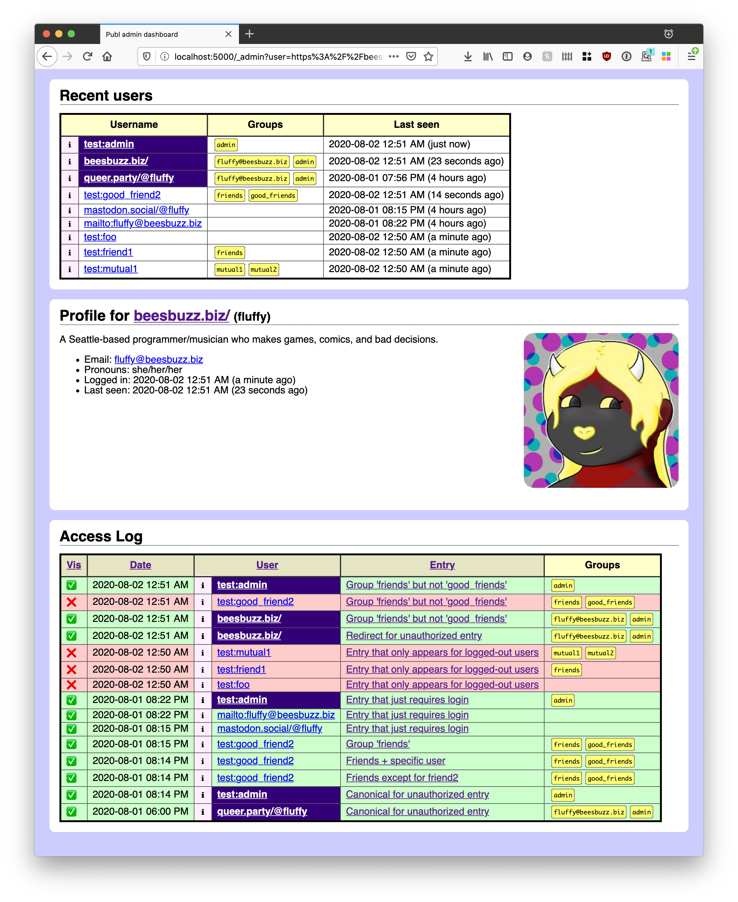

Title: Admin dashboard
Tag: admin
Tag: auth
Date: 2020-08-02 00:35:36-07:00
Entry-ID: 732
UUID: 9bf2d96c-e0c4-508d-91e9-991d6f96498a

Information about the administration dashboard

.....

The administration dashboard is available to anyone who is in the administration group, as configured by the [user configuration](1341) and [application configuration](865#admin_group). It is accessed by going to the `/_admin` path on the website; on this site you can [log in as `test:admin`](/_login/_admin?me=test:admin) for a demonstration.

For this to be available, Publ needs to be configured with authentication, and there must be at least one user in the administrators group.

The dashboard provides information about the operation of the site; of particular interest, it shows the recent authentication activity, such as the recent users, and both authorized and unauthorized accesses to [protected entries](322#auth).

Any time a user identity is presented, you can copy the link itself to add to your [user configuration](1341), or you can visit the user's profile link (designated with an ℹ︎ symbol) to view their user profile.

