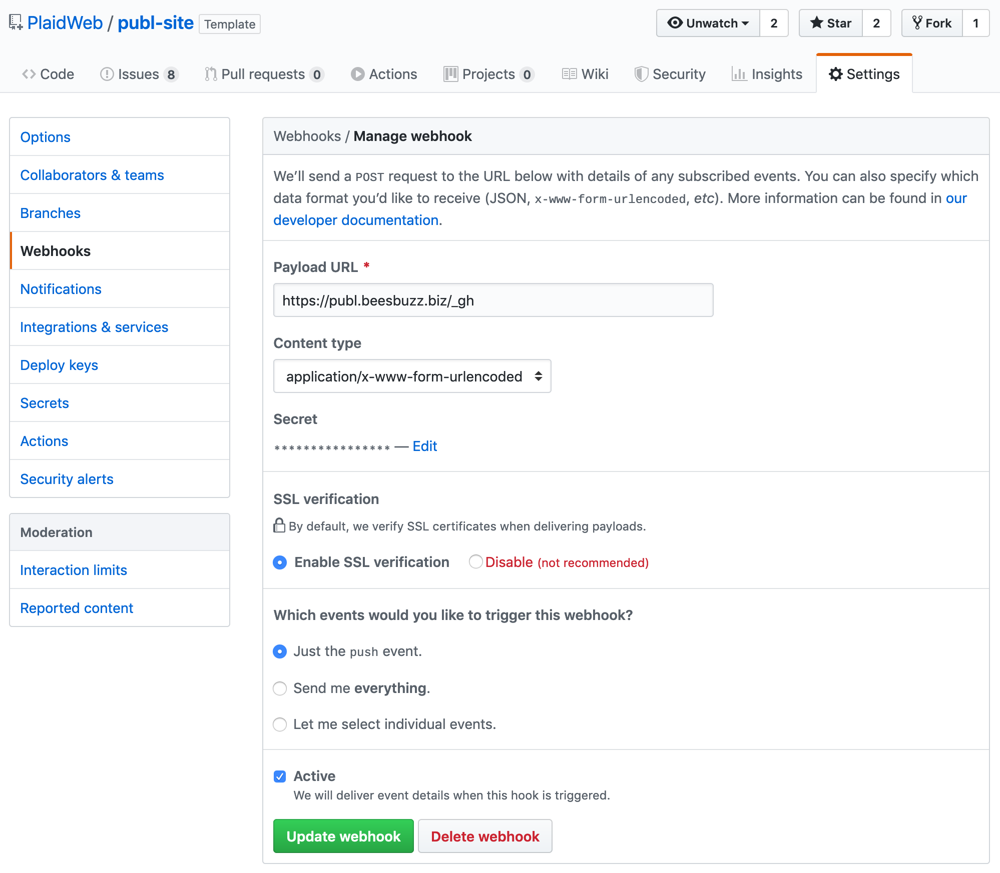

Title: Continuous deployment with git
Date: 2018-12-16 23:23:07-08:00
Entry-ID: 441
Sort-Title: 200
UUID: b023c99e-0f41-51ea-9d41-5e575b37339d

How to use git hooks to automatically deploy site content

.....

This is the approach I use for managing my site content on [my main website](http://beesbuzz.biz). It requires that you can run shell scripts from your git repositories, and ideally your git repository lives on the same server as your actual Publ installation.

This applies to any hosting setup where you log in to a server directly to manage your files and applications, such as [self-hosting](self-hosting.md) or using [Passenger](passenger.md). Other hosting environments (Heroku, Docker, etc.) will likely need a different build-and-deploy mechanism.

## Deployment script

Regardless of how you manage your deployment trigger, you will need a deployment script, which does a `git pull` and updates package versions if the `Pipfile.lock` has changed. Save this file as `deploy.sh` in your website repository, and make sure it's set executable:

```bash
#!/bin/sh
# wrapper script to pull the latest site content and redeploy

cd  $(dirname $0)

# see where in the history we are now
PREV=$(git rev-parse --short HEAD)

git pull --ff-only || exit 1

if git diff --name-only $PREV | grep -qE '^(templates/|app\.py)' ; then
    echo "Configuration or template change detected"
    disposition=reload-or-restart
fi

if git diff --name-only $PREV | grep -q Pipfile.lock ; then
    echo "Pipfile.lock changed"
    pipenv install || exit 1
    disposition=restart
fi

if [ "$1" != "nokill" ] && [ ! -z "$disposition" ] ; then
    # insert server restart command here (see note)
fi
```

There's a bit of wiggle room in how you actually restart the service. If you're using [a systemd user service](1278#systemd) to manage your process, you can use something like:

```bash
    systemctl --user $disposition SERVICE-NAME.service
```

Otherwise, you can put this at the bottom of your `app.py`:

```python
with open('.run.pid', 'w') as pidfile:
    pidfile.write(os.getpid())
```

and then use this to restart the server:

```bash
    [ -f .run.pid ] && kill -HUP $(cat .run.pid) && rm .run.pid
```

This will only tell gunicorn to reload, however, and it probably won't cause the new version of gunicorn itself to start up, in case that's a concern.

The remainder of the deployment process depends on how you're actually hosting your git repository.

## Self-hosted git repository

### Repository on same server as the website

On your webserver, create a private bare git repository wherever you want it; for example, if you have your deployed website in `$HOME/example.com`, this will create a bare repository in `$HOME/sitefiles/example.com.git`:

```bash
mkdir -p $HOME/sitefiles
cd $HOME/sitefiles
git clone --bare $HOME/example.com example.com.git
```

Now you'll have a bare repository in `sitefiles/example.com.git` and an application directory in `example.com`.

Back wherever you're actually developing your website, add the new bare repository as a remote, for example:

```bash
git remote add publish username@servername:sitefiles/example.com.git
```

Finally, add a `post-update` hook to the bare repository, e.g. `$HOME/sitefiles/example.com.git/hooks/post-update`:

```bash
#!/bin/sh

echo "Deploying new site content..."

cd $HOME/example.com
unset GIT_DIR
./deploy.sh
```

In this situation, you might also want to [share the object store between the bare repo and the deployment](https://git.wiki.kernel.org/index.php/Git_FAQ#How_to_share_objects_between_existing_repositories.3F), to save on some disk space; for example:

```bash
cd $HOME/sitefiles/example.com.git
git gc
cd $HOME/example.com
echo "$HOME/sitefiles/example.com.git/objects/" > .git/objects/info/alternates
git gc
```

### Separate servers using an `ssh` key

If you keep your git repository on a separate server from where it's deployed to, set up an [ssh key](https://www.ssh.com/ssh/key/) or other authentication mechanism other than password so that you can do passwordless ssh from the repository server to the deployment server, and then add this as a `post-update` hook on the repository:

```bash
#!/bin/sh

echo "Deploying new site content..."

ssh DEPLOYMENT_SERVER 'cd example.com && ./deploy.sh'
```

replacing `DEPLOYMENT_SERVER` with the actual server name, and `example.com` with the directory that contains the site deployment.


## Simple webhook deployment

If you don't have the ability to run arbitrary `post-update` hooks but do have some sort of webhook functionality, you can add a webhook to your Publ site to run `deploy.sh`; for example, you can add this to your `app.py`:

```python
@app.route('/_deploy', methods=['POST'])
def deploy():
    import threading
    import signal
    import subprocess
    import flask

    if flask.request.form.get('secret') != os.environ.get('REDEPLOY_SECRET'):
        return flask.abort(403)

    try:
        result = subprocess.check_output(
            ['./deploy.sh', 'nokill'],
            stderr=subprocess.STDOUT)
    except subprocess.CalledProcessError as err:
        logging.error("Deployment failed: %s", err.output)
        return flask.Response(err.output, status_code=500, mimetype='text/plain')

    def restart_server(pid):
        logging.info("Restarting")
        os.kill(pid, signal.SIGHUP)

    logging.info("Restarting server in 3 seconds...")
    threading.Timer(3, restart_server, args=[os.getpid()]).start()

    return flask.Response(result, mimetype='text/plain')
```

Then,  in whatever mechanism you use to run the website, set the environment variable `REDEPLOY_SECRET` to some secret string. For example, if you're using a `systemd` service, add a line like:

    Environment="REDEPLOY_SECRET=the secret password"

Deploy these changes to your website and restart it. Now you can configure a webhook on your git repository that sends a POST request to the `/_deploy` route with the `secret` parameter set to your `REDEPLOY_SECRET` key.

## GitHub-style web hooks

If you're using GitHub (or something GitHub-compatible) to host your site files, there is a more secure way to run a webhook.

First, install the [flask-hookserver](https://pypi.org/project/flask-hookserver) package with `pipenv install flask-hookserver`.

Next, add the following to your `app.py` somewhere after the `app` object gets created:

```python
from flask_hookserver import Hooks

app.config['GITHUB_WEBHOOKS_KEY'] = os.environ.get('GITHUB_SECRET')
app.config['VALIDATE_IP'] = False

hooks=Hooks(app, url='/_gh')

@hooks.hook('push')
def deploy(data, delivery):
    import threading
    import signal
    import subprocess
    import flask

    try:
        result = subprocess.check_output(
            ['./deploy.sh', 'nokill'],
            stderr=subprocess.STDOUT)
    except subprocess.CalledProcessError as err:
        logging.error("Deployment failed: %s", err.output)
        return flask.Response(err.output, status_code=500, mimetype='text/plain')

    def restart_server(pid):
        logging.info("Restarting")
        os.kill(pid, signal.SIGHUP)

    logging.info("Restarting server in 3 seconds...")
    threading.Timer(3, restart_server, args=[os.getpid()]).start()

    return flask.Response(result, mimetype='text/plain')
```

Now, set up your deployment to have an environment variable called `GITHUB_SECRET` set to some random, unguessable string. Do a manual redeployment.

Finally, go to your GitHub repository settings, then "Webhooks," then "Add webhook." On the new webhook, set your payload URL to your deployment hook (e.g. `http://example.com/_gh`), the content type to `application/x-www-form-urlencoded`, and the secret to the value of your `GITHUB_SECRET` string. It should look something like this:



Anyway, once you have it set up, every time you commit to GitHub, your site should automatically pull and redeploy the latest changes.

An example of this in action can be seen at the [files for this site](/github-site); in particular, see the [`app.py`](https://github.com/PlaidWeb/publ-site/blob/master/app.py) and [`deploy.sh`](https://github.com/PlaidWeb/publ-site/blob/master/deploy.sh) files.

